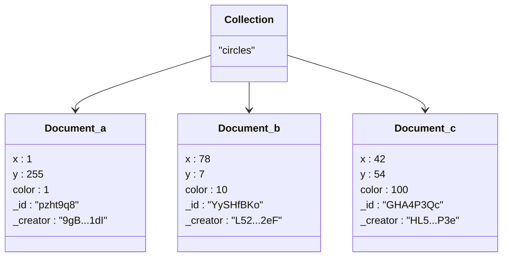

# olta.js

## <a name='WhatisOlta.js'></a>What is Olta.js ?
A javascript api to trigger and listen to changes for artworks using the [olta collective](https://collective.olta.art/) smart contracts.

It let's you build artworks with persistent state changes in a decentralized manner. Data is stored permanently, publicly and you get fast a response time thanks to Warp Smart Contracts, and Arweave. We abstract away user authentication, tailor database schema, allow for easy showcasing and remove any recurring database fees. Allowing for you to concentrate on making collective art.

## Contents
<!-- vscode-markdown-toc -->
- [olta.js](#oltajs)
  - [What is Olta.js ?](#what-is-oltajs-)
  - [Contents](#contents)
  - [alpha Version](#alpha-version)
  - [API Docs](#api-docs)
  - [Getting started](#getting-started)
    - [1. Connect Wallet](#1-connect-wallet)
    - [2. Create a Project](#2-create-a-project)
      - [2a. Details](#2a-details)
      - [2b. Data](#2b-data)
      - [2c. Collection](#2c-collection)
      - [2d. Permissions](#2d-permissions)
      - [2e. Initial State](#2e-initial-state)
      - [2f. Deploy](#2f-deploy)
    - [3. Developing](#3-developing)
      - [install](#install)
      - [Setup](#setup)
      - [read the state](#read-the-state)
      - [Create A Document](#create-a-document)
      - [Update A Document](#update-a-document)
  - [Examples](#examples)
    - [tiles](#tiles)
    - [rectangles](#rectangles)
    - [cuboids](#cuboids)
  - [To Run Locally](#to-run-locally)
    - [Prerequisites](#prerequisites)
      - [Node.js](#nodejs)
      - [Arlocal](#arlocal)
    - [Dashboard](#dashboard)

<!-- vscode-markdown-toc-config
	numbering=false
	autoSave=true
	/vscode-markdown-toc-config -->
<!-- /vscode-markdown-toc -->


<!-- TODO: reporting bugs -->
<!-- TODO: decide on what to call things, e.g database, project, smart contract -->

<!-- TODO: find a good spot for this -->
<!-- TODO: suggest staying on testnet ? -->
## <a name='alphaVersion'></a>alpha Version
> [!IMPORTANT]
> Functionality is limited and there are likely bugs around.
> This is very much still in development and we have intentionally kept the feature set to a minimum for now while we find the best approach.
>
> *Restricted features include:*
>  - only integers are stored (no strings, arrays, nested objects, floating points)
>  - only 1 collection can be made right now.
>  - no conditional updating (e.g only update when value x is more than y)
>  - no error handling (if you trigger an update an it is canceled or fails there is no way of knowing -> bad ux)
>  - no `read` or `delete` actions, only `create` and `update` are available
>


## <a name='APIDocs'></a>API Docs
API documentation can be found [here in API.md](./API.md)

## <a name='Gettingstarted'></a>Getting started
### <a name='ConnectWallet'></a>1. Connect Wallet
To get started head to [Olta Collective](https://collective.olta.art/) and hit connect. An Othent popup should appear, you can sign in via email or using gmail.

> [!NOTE]
> <details>
>  <summary>
>  What is Othent?
>  </summary>
>  <a href="https://othent.io/">Othent</a> is a key management service that creates an arweave wallet address for you. Currently Othent pays for all transaction fees so everything is free.
> </details>

> [!NOTE]
> For now the default network is testnet

### <a name='CreateaProject'></a>2. Create a Project

Creating a project will deploy a new smart contract to act as our place to store the state of the project. Head to the [create form](https://collective.olta.art/create/)

#### <a name='a.Details'></a>2a. Details
When creating a project we have to define a few details (this can all be changed later) At a minimum give it a title.

#### <a name='b.Data'></a>2b. Data
To set up persistent state changes in an artwork, there is a predefined structure you need to use. First you need to understand the concept of collections, documents, and properties, commonly found in document-oriented databases (often referred to as NoSQL).



##### Collection
A group of documents of a similar structure. In the context of an artwork, you might have a collection called `"circles"` that contains all the movable circles.

##### Document
An individual record within a collection. Continuing with our circle artwork each document represents one circle and contains properties required to render it. Each document has a unique id (within that collection) as well as other metadata like who created it

##### Property
A field or a key value pair within a document. In our example there is `x` `y` `color` properties for rendering a circle in a location and a given color.

> [!TIP]
> ##### Meta Properties
> <details>
> <summary>
>   Each document also contains meta properties about itself.
> </summary>
> They are read only, prefaced with `_` and are automatically added by the smart contract.
> 
> |  |  |
> |---|---|
> |`_id`| Useful for updating specific documents, see [update a document](#update-a-document)|
> | `_creator` | Is the wallet address of who created the document, useful for filtering based on user. |
> | `_sortKey` | Can be used to order documents
> </details>

> [!TIP]
> In javascript think of collection as an array of objects
> ```js
>  const collection = [
>    {
>     x: 1,
>     _id: "pzht9q8"
>    },
>    {
>     x: 255,
>     _id: "GHA4P3Qc"
>    },
>  ]
> ```

Having this strict structure lets us create rules for how collections, documents and properties can be changed. For example: only letting the user who created the circle update it later, or making it so no one can add new circles only move them around.

#### <a name='c.Collection'></a>2c. Collection

Give your collection a name, it often makes sense to make it a plural e.g `colours`, `animals` or `values`. And define a schema for each document inside that collection. You can add multiple properties, for now the value type is limited to BigInt which is javascript version of Integer. You can set a min and a max value by expanding the property.

I'm gonna stick with the default and set the collection name to `colors` and have one property called `value` with a min of `0` and a max of `255`

> [!IMPORTANT]
> make sure to give the properties unique names

---

#### <a name='d.Permissions'></a>2d. Permissions

The permissions section sets who is allowed to do what in your collection. You have options for creating and updating documents

| create permission | Description |
| --- | --- |
| anyone | any user can create a new document in the collection
| only admin | only you the artist can create documents in this collection
| no one | no user can create documents in this collection (useful for keeping it a fixed amount)

| updating permission | Description |
| --- | --- |
| anyone | any user can update an existing document in the collection
| only admin | only you the artist can update documents in this collection
| no one | no user can update documents in this collection (useful for keeping the document the same as it was created)

> [!NOTE]
> `delete` permissions will be added in the future

#### <a name='e.InitialState'></a>2e. Initial State

The initial state is what the database will look like before any users have changed it.

You can generate some `random` documents. This will give the documents any values between the min and max. Or choosing `default` will give the properties the min value.

If you would like to have no initial state to begin with _i.e no documents in your collection, it will all be user generated then set the generate number to `0`.

#### <a name='f.Deploy'></a>2f. Deploy

Hit deploy and wait a little bit, once done this will redirect you to the project page.


### <a name='Developing'></a>3. Developing

Lets get setup so you can develop using `olta.js` locally.
To get olta js:

#### <a name='install'></a>install

npm
```
npm i @olta/js-sdk
```
yarn
```
yarn add @olta/js-sdk
```
<!-- TODO: test this actually works -->
```js
import { Olta } from '@olta/js-sdk'
```

##### or with a script tag
create a copy of [olta.js](https://raw.githubusercontent.com/olta-art/olta.js/main/lib/olta.js) file and add a script tag to your html
```html
<script src="./olta.js"></script>
```

#### <a name='setup'></a>Setup
To get the project displaying in the dashboard head to the `viewer` of your project. Click on `Override Content Url?` option and input a url of your locally running project. For example `http://localhost:5000`.


#### <a name='readthestate'></a>read the state
lets create some text displaying all the documents in the collection.
```js
// initialize
const olta = Olta()

// listen for updates
olta.onUpdate(() => {
  // change "colors" to whatever you named your collection
  const colors = olta.getAll("colors")

  // lets simply just log out colors
  console.log("documents", colors)
})
```

We use the [onUpdate](./API.md#oltaonupdatecallback) function to listen for updates. And the [getAll](./API.md#oltagetallcollectionid-⇒-arrayobject--undefined) function to read all the current documents in the colors collection

Looking at your project from the `viewer` in the dashboard you should see an array of all the documents printed to the browser console.

> [!NOTE]
> Make sure you have some "documents" in your smart contract. Head to the `manage` tab to see the current state of you smart contract. You can also `create` and `update` documents from there given you have the relevant permissions

##### Using a render function

Lets create a render function to run on every update for this example we'll render the colors as a button in html

```js
// with `value` having a min of 0 and max of 3 we can have 4 colors
const colorScheme = [
  "red",
  "green",
  "blue",
  "black"
]

function render(docs){
  // simply do nothing if docs is undefined
  if(!docs){
    return
  }

  // create the html of buttons with each button background showing the color and the id
  const buttons = docs.map(doc => `
    <button style="background=${colorScheme[doc.value]}>${doc._id}</button>
  `).join("")

  // display the buttons
  document.body.innerHtml = buttons
}

olta.onUpdate(() => {
  const colors = olta.getAll("colors")

  // use the render function
  render(colors)
})
```

See the [examples](#examples) section for more in depth library specific examples.

#### <a name='CreateADocument'></a>Create A Document

To create a new document in a collection we can use the `create` function. The id is generated automatically on the contract. So you just need to provide it with an object with the correct properties.

For example here we create a new random color on click
```js
// function to create a new colors document
function randomColorDoc () {
  return {
    value: math.random() * 4
  }
}

// create on click
document.addEventListener("click",  olta.create("colors", randomColorDoc))
```

>[!TIP]
> Make sure to listen for updates using the [onUpdate](./API.md#oltaonupdatecallback) function so any new documents are rendered.

#### <a name='UpdateADocument'></a>Update A Document

To update a document it is similar to create but we must specify an id.
For example:
```js
olta.update(collectionName, {
  // id must be supplied
  id: docId,
  // all other properties go here e.g
  value: 1
})
```

The difficult part is how do you know the docId? Id's are automatically generated on the smart contract and so the best way to find them is by using the `getAll` function. Every document will have have a `._id` property that can be used.

In the example below we get the doc id by randomly selecting a colors document.

```js
// store the colors collection
let colors = []

olta.onUpdate(() => {
  // set colors on every update
  colors = olta.getAll("colors")

  // render stuff goes here
})

// on click we update a random color to a random color
document.addEventListener("click", () => {
  // do nothing if no colors
  if(colors.length < 1){
    return
  }

  // get a random index from the colors array
  randomIndex = math.floor(math.random() * colors.length)

  // the chosen doc
  const doc = colors[randomIndex]

  // create a new updated color doc
  const updatedDoc = {
    // use the id from our chosen doc
    id: doc._id
    // set it to a random color
    value: math.random() * 4
  }

  // finally we update that doc
  olta.update("colors", updatedDoc)
})

```
<!-- TODO -->
  - publishing (vercel, or arweave)

<!-- TODO: rework getting started -->
---

## <a name='Examples'></a>Examples

### <a name='tiles'></a>tiles
This example uses no framework and renders out things using the DOM. It will work with any project. It represents each document as a box and each property as a color in the box. This way you can easily visualise the data on the project.

You can hover over properties to view the data.

[code](./examples/tiles/index.html)

### <a name='rectangles'></a>rectangles
This example uses `p5.js` and renders out gray rectangles. You can click to `create` a new rectangle.

[code](./examples/rectangles/index.html)

### <a name='cuboids'></a>cuboids
This example uses `three.js` and renders out 100 cuboids with specific colors. You can `update` the color by clicking

[code](./examples/cuboids/index.html)

---

## <a name='ToRunLocally'></a>To Run Locally

It is possible to run a local version of arweave to test how interactions might happen. This can speed up development by not waiting for interactions over the network. It also means you can test in private.

### <a name='Prerequisites'></a>Prerequisites

#### <a name='Node.js'></a>Node.js

You'll need [Node.js](https://nodejs.org/en/download) installed.

to check everything is installed correctly

run this in a terminal
```
node -v
```

You should see version number.

#### <a name='Arlocal'></a>Arlocal

We will use [arlocal](https://github.com/textury/arlocal) to run a local arweave blockchain (not as scary as it sounds)

Open a terminal and run:
```
npx arlocal
```

This will install arlocal onto your machine and run an instance of it on the port number 1984. Next time you run it it simply spins up an instance.

> **Note** `arlocal` produces logs the folder it is run from. If you run it in the same folder as your project please watch out for it triggering hot reloads when not desired.

### <a name='Dashboard'></a>Dashboard

Once you have arlocal running head back to the dashboard click on the wallet settings icon in the sidebar. Select wallet type: local, network: local. Refresh the page and it should detect arlocal and generate a fresh wallet.

You can then experiment to your hearts content.
